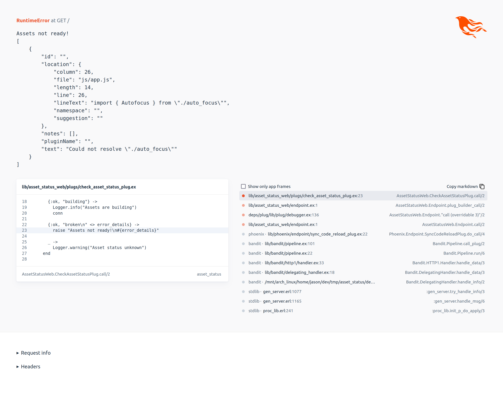

# AssetStatus Error Example

This is a simple example phoenix app that includes a plug that hooks into an esbuild plugin to show the developer an error when their assets are not building successful (and prevent serving pages in dev mode when that is true)

Inspired by the question in this ElixirForum post: https://elixirforum.com/t/how-do-i-make-phoenix-server-refuse-to-serve-pages-when-theres-an-error-in-assets/61538

When there is an error you will see an error like:

This example app by default is in the broken assets state, to fix the assets comment out the broken line in `assets/js/app.js`

I have no intention of publishing this as a library but feel free to include it in your project or release it as a library. I'm releasing this under an MIT license.
